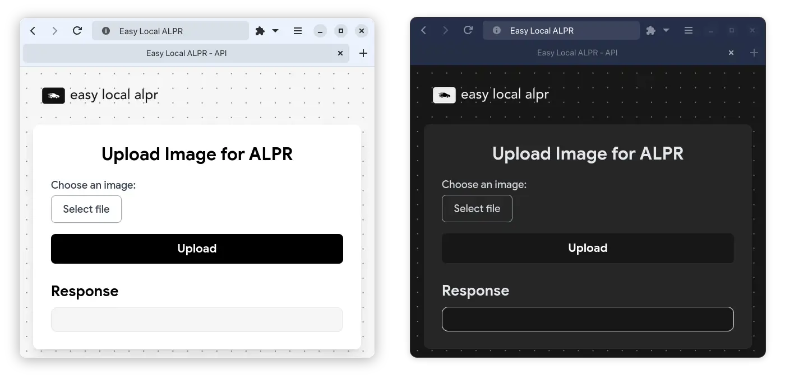
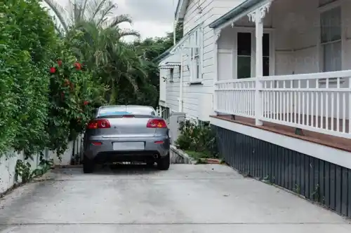
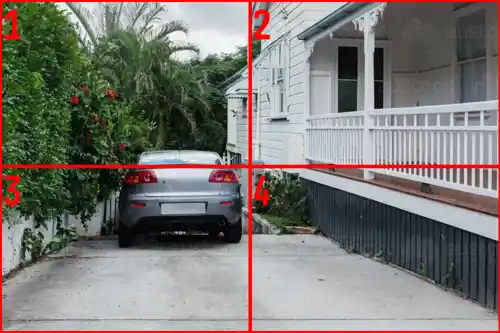

#  Easy Local ALPR (Automatic License Plate Recognition)
This project is a simple local ALPR (Automatic License Plate Recognition) server that uses the [ultimateALPR-SDK](https://github.com/DoubangoTelecom/ultimateALPR-SDK) to
process images and return the license plate information found in the image while focusing on being:
- **Fast** *(~100ms per image on decent CPU)*
- **Lightweight** *(~100MB of RAM)*
- **Easy to use** *(REST API)*
- **Easy to setup** *(one command setup)*
- **Offline** *(no internet connection required)*

> [!IMPORTANT]
> This project relies on the [ultimateALPR-SDK](https://github.com/DoubangoTelecom/ultimateALPR-SDK), which is a commercial product but has a free version with a few limitations.
> For any commercial use, you will need to take a look at their licensing terms.  
> **I am not affiliated with ultimateALPR-SDK in any way, and I am not responsible for any misuse of the software.**

> [!NOTE]
> The [ultimateALPR-SDK](https://github.com/DoubangoTelecom/ultimateALPR-SDK) is a lightweight and much faster alternative (on CPU and GPU) than existing solutions but it has **one important restriction** with it's free version:
> - The last character of the license plate is masked with an asterisk *(e.g. ``ABC1234`` -> ``ABC123*``)*

## Installation
Simply download the latest release from the [releases page](./releases) and run the executable.

The following platforms are currently supported:
- **Linux** (x86_64)

## Usage

The server listens on port 5000 and has a few endpoints documented below, the most important one being [``/v1/image/alpr``](#v1visionalpr).

### /v1/vision/alpr

> POST: http://localhost:5000/v1/vision/alpr

**Description**  
This endpoint processes an image and returns the license plate information (if any) found in the image.
**Parameters**

- upload: (File) The image file to process. *(
  see [Pillow.Image.open()](https://pillow.readthedocs.io/en/stable/reference/Image.html#PIL.Image.open) for supported
  formats, almost any image format is supported)*
- grid_size: (Integer, optional) Size of grid to divide the image into and retry on each cell when no match have been
  found on the whole image, must be ``>=2`` *(default: 0, disabled)* **[(more info)](#more-information-about-the-grid-parameter)**
- wanted_cells: (String, optional) The cells you want to process *(default: all cells)* **[(see here for more details)](#v1visionalpr_grid_debug)**
    - format: ``1,2,3,4,...`` *(comma separated list of integers, max: ``grid_size^2``)*
    - *Example for a grid_size of 3:*
      ```
        1 | 2 | 3
        4 | 5 | 6
        7 | 8 | 9
      ```
- whole_image_fallback: (Boolean, optional) Only applies when ``grid_size`` is greater than 2.
  If set to true, the server will first try to detect the plate from the ``wanted_cells`` parameter and if no plate is found, it will then try to detect the plate on the whole image.
  If set to false, the server will only try to detect the plate on the specified cells. *(default: true)*

**Response**

```jsonc
{
  "duration": (Float) // The time taken to process the image in milliseconds.
  "plates": List // An array of plates found in the image.
  "predictions": (Object[]) // An array of objects with the x_max, x_min, y_max, y_min bounds of the plate, image, the plate chars and confidence.
}
```

**Example**
```json
{
  "duration": 142.02,
  "plates": [
    "XX12345*",
    "YY5432*"
  ],
  "predictions": [
    {
      "confidence": 0.9009034,
      "image": "data:image/png;base64,xxxxx==",
      "plate": "XX12345*",
      "x_max": 680,
      "x_min": 610,
      "y_max": 386,
      "y_min": 355
    },
    {
      "confidence": 0.8930383999999999,
      "image": "data:image/png;base64,xxxxx==",
      "plate": "YY5432*",
      "x_max": 680,
      "x_min": 483,
      "y_max": 706,
      "y_min": 624
    }
  ]
}
```


### /v1/vision/alpr_grid_debug

> POST: http://localhost:5000/v1/vision/alpr_grid_debug

**Description**
This endpoint displays the grid and each cell's number on the image.
It is intended to be used for debugging purposes to see which cells are being processed.

**Parameters**  
*same as [v1/vision/alpr](#v1visionalpr)*

**Response**

```jsonc
{
  "image": (Base64) // The image with the grid and cell numbers drawn on it.
}
```

## More information about the grid parameter

Sometimes, the ALPR software cannot find any plate because the image is too big or the plate is too small in the image.
To solve this problem, you can make use of the ``grid_size`` parameter in each of your requests.
If you set the ``grid_size`` parameter to a value greater than 2, the server will divide the image into a grid of cells
and retry the ALPR software on each cell.

You can speed up the processing time by specifying the ``wanted_cells`` parameter. This parameter allows you to specify
which cells you want to run plate detection on.
This can be useful if you know the plates can only be in certain areas of the image.
> [!TIP]
> You can use the [``/v1/vision/alpr_grid_debug`` endpoint](#v1visionalpr_grid_debug) to see the grid and cell numbers
> overlaid on your image.
> You can then specify the ``wanted_cells`` parameter to only process the cells you want.

**If you wish not to use the grid, you can set the ``grid_size`` parameter to
0 or leave it empty *(and leave the ``wanted_cells`` parameter empty)*.**

### Example

Let's say your driveway camera looks something like this:



If you set the ``grid_size`` parameter to 2, the image will be divided into a 2x2 grid like this:



You can see that cell 1 and 2 are empty and cells 3 and 4 might contain license plates.
You can then set the ``wanted_cells`` parameter to ``3,4`` to only process cells 3 and 4, reducing the processing time
as only half the image will be processed.

## Included models in built executable

When using the built executable, only the **latin** charset models are bundled by default. If you want to use a
different charset, you need to set the charset in the JSON_CONFIG variable and rebuild the executable with the
according models found [here](https://github.com/DoubangoTelecom/ultimateALPR-SDK/tree/master/assets)
To build the executable, you can use the ``build_alpr_api.sh`` script, which will create an executable
named ``alpr_api`` in the ``dist`` folder.

## Setup development environment

### Use automatic setup script

> [!IMPORTANT]
> Make sure to install the package python3-dev (APT) python3-devel (RPM) before running the build and setup script.
> You can use the ``build_and_setup_ultimatealvr.sh`` script to automatically install the necessary packages and build
> the
> ultimateALPR SDK wheel, copy the assets and the libs.

The end structure should look like this:

```bash
.
├── alpr_api.py
├── assets
│   ├── fonts
│   └── models
├── libs
│   ├── libxxxxxx.so
│   ├── ...
│   └── libxxxxxx.so
└── ...
```

### Important notes

When running, building or developing the script, make sure to set the ``LD_LIBRARY_PATH`` environment variable to the
libs folder
*(limitation of the ultimateALPR SDK)*.

```bash
export LD_LIBRARY_PATH=libs:$LD_LIBRARY_PATH
```

### Error handling

#### GLIBC_ABI_DT_RELR not found

If you encounter an error like this:

```bash
/lib/x86_64-linux-gnu/libc.so.6: version `GLIBC_ABI_DT_RELR' not found
```

Then make sure your GLIBC version is >= 2.36
