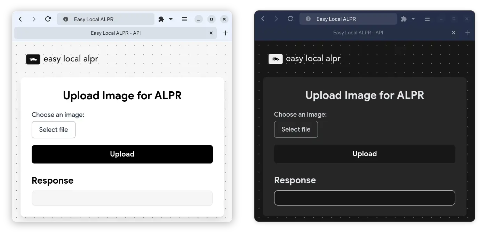

# Easy local ALPR (Automatic License Plate Recognition)



This script is a REST API server that uses [ultimateALPR-SDK](https://github.com/DoubangoTelecom/ultimateALPR-SDK)  to process images and return the license plate
information. The server is created using Flask and the ultimateALPR SDK is used to process the images.

This script is intended to be used as a faster local alternative to the large and resource heavy [CodeProject AI](https://www.codeproject.com/AI/docs) software.
> [!IMPORTANT]
> The ultimateALPR SDK is a lightweight and much faster alternative (on CPU and GPU) to the CodeProject AI software but it has **a few limitations** with it's free version:
> - The last character of the license plate is masked with an asterisk
> - The SDK supposedly has a limit of requests per program execution *(never encountered yet)* **but I have implemented a workaround for this by restarting the SDK after 3000 requests just in case.**


## Usage
The server listens on port 5000 and has a few endpoints (see below), the most important one being ``/v1/image/alpr``.

### /v1/vision/alpr
> POST: http://localhost:5000/v1/vision/alpr

**Description**  
This endpoint processes an image and returns the license plate information (if any) found in the image.  
This endpoint follows the [CodeProject AI ALPR API](https://www.codeproject.com/AI/docs/api/api_reference.html#license-plate-reader) format *(example below)* so it can be used as a **drop-in replacement** for the CodeProject AI software.

**Parameters**  
- upload: (File) The image file to process. *(see [Pillow.Image.open()](https://pillow.readthedocs.io/en/stable/reference/Image.html#PIL.Image.open) for supported formats, almost any image format is supported)*
- grid_size: (Integer, optional) Size of grid to divide the image into and retry on each cell when no match have been found on the whole image *(default: 4)* **[(more info)](#more-information-about-the-grid-parameter)**
- wanted_cells: (String, optional) The cells you want to process *(default: all cells)* **[(see here)](#v1visionalpr_grid_debug)**
    - format: ``1,2,3,4,...`` *(comma separated list of integers, max: grid_size^2)*
    - *Example for a grid_size of 3:*
      ```
        1 | 2 | 3
        4 | 5 | 6
        7 | 8 | 9
      ```
      

  **Response**
```json
{
  "success": (Boolean) // True if successful.
  "message": (String) // A summary of the inference operation.
  "error": (String) // (Optional) An description of the error if success was false.
  "predictions": (Object[]) // An array of objects with the x_max, x_min, max, y_min bounds of the plate, label, the plate chars and confidence.
  "processMs": (Integer) // The time (ms) to process the image (includes inference and image manipulation operations).
}
```

### /v1/vision/alpr_grid_debug
> POST: http://localhost:5000/v1/vision/alpr_grid_debug

**Description**
This endpoint displays the grid and each cell's number on the image.
It is intended to be used for debugging purposes to see which cells are being processed.

**Parameters**
*same as [v1/vision/alpr](#v1visionalpr)*

  **Response**
```json
{
  "image": (Base64) // The image with the grid and cell numbers drawn on it.
}
```

## More information about the grid parameter
*To write*


## Included models in built executable
When using the built executable, only the **latin** charset models are bundled by default. If you want to use a different 
charset, you need to set the charset in the JSON_CONFIG variable and rebuild the executable with the according
models found [here](https://github.com/DoubangoTelecom/ultimateALPR-SDK/tree/master/assets)
To build the executable, you can use the ``build_alpr_api.sh`` script, which will create an executable named ``alpr_api`` in
the ``dist`` folder.

## Setup development environment

### Use automatic setup script
You can use the ``build_and_setup_ultimatealvr.sh`` script to automatically install the necessary packages and build the ultimateALPR SDK wheel, copy the assets and the libs.
> [!IMPORTANT]
> Make sure to install the package python3-dev (APT) python3-devel (RPM) before running the build and setup script.

The end structure should look like this:
```bash
.
├── alpr_api.py
├── assets
│   ├── fonts
│   └── models
├── libs
│   ├── libxxxxxx.so
│   ├── ...
│   └── libxxxxxx.so
└── ...
```

### Important notes
When running, building or developing the script, make sure to set the ``LD_LIBRARY_PATH`` environment variable to the libs folder
*(limitation of the ultimateALPR SDK)*.
```bash
export LD_LIBRARY_PATH=libs:$LD_LIBRARY_PATH
```

### Error handling
#### GLIBC_ABI_DT_RELR not found
If you encounter an error like this:
```bash
/lib/x86_64-linux-gnu/libc.so.6: version `GLIBC_ABI_DT_RELR' not found
```
Then make sure your GLIBC version is >= 2.36
